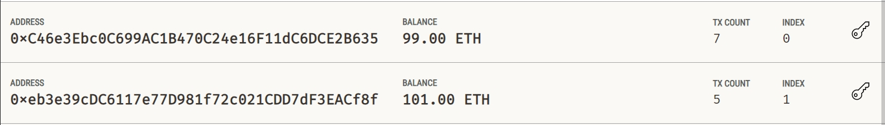
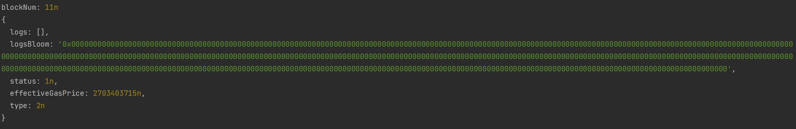
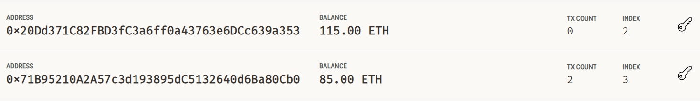

# 一 web3.js 第一个交易

## 1 环境

​	**nodejs:v20.9.0**

​	**solc:0.8.24**

​	**web3js:4.22**

## 2 Web3.providers.HttpProvider()

​	该方法可以连接到本地blockchain网络

## 3 案例

```
const {Web3} = require('web3');

const provider = new Web3.providers.HttpProvider('HTTP://127.0.0.1:7545');

const web3 = new Web3(provider);

async function main() {
    const blockNum = await web3.eth.getBlockNumber();
    console.log("blockNum:", blockNum);

    const accounts = await web3.eth.getAccounts();

    const transactionReceipt = await web3.eth.sendTransaction({
        from: accounts[0],
        to: accounts[1],
        value: web3.utils.toWei('1', 'ether'),
    });
    console.log(transactionReceipt)

}

main();
```






# 二 以太坊交易

## 1 本地钱包

​	准备sender钱包私钥 receiver钱包地址

```
// First step: initialize `web3` instance
const { Web3 } = require('web3');
const web3 = new Web3('HTTP://127.0.0.1:7545');
// Second step: add an account to wallet
const privateKeyString = '0x185dec91c2e7aff0bb10c81ac058cbf69accd2e013a86bd1a338152822ca8781';
const account = web3.eth.accounts.wallet.add(privateKeyString).get(0);
// Make sure the account has enough eth on balance to send the transaction
async function sendTransaction() {
    // Third step: sign and send the transaction
    // Magic happens behind sendTransaction. If a transaction is sent from an account that exists in a wallet, it will be automatically signed.
    try {
        const receipt = await web3.eth.sendTransaction({
            from: account?.address,
            to: '0x20Dd371C82FBD3fC3a6ff0a43763e6DCc639a353',
            value: web3.utils.toWei('15','ether'),
            gas: '300000',
            // other transaction's params
        });
    } catch (error) {
        // catch transaction error
        console.error(error);
    }
}
(async () => {
    await sendTransaction();
})();
```



# 三 智能合约

## 1 solc获取abi&bytecode

1. 读取solidity文件 

2. 准备好solc编译配置Json

3. ```
   const input = {
       language: 'Solidity',
       sources: {
           [fileName]: {
               content: sourceCode,
           },
       },
       settings: {
           outputSelection: {
               '*': {
                   '*': ['*'],
               },
           },
       },
   };
   ```

   解析Json 使用 

   ```
   const compiledCode = JSON.parse(solc.compile(JSON.stringify(input)));
   ```

4. 根据解析到的编码获取bytecode

   ```
   const bytecode = compiledCode.contracts[fileName[contractName].evm.bytecode.object;
   ```

5. 获取abi旧版本为interface

6. ```
   const abi = compiledCode.contracts[fileName][contractName].abi;
   ```

   可以选择export abi和bytecode或者保存在文件

   ```
   fs.writeFileSync(bytecodePath, bytecode);
   fs.writeFileSync(abiPath, JSON.stringify(abi, null, '\t'));
   ```

   ```
   // This code will compile smart contract and generate its ABI and bytecode
   // Alternatively, you can use something like `npm i solc && npx solcjs MyContract.sol --bin --abi`
   
   const fs = require("fs");
   const solc = require("solc");
   const path=require("path")
   
   const fileName = 'MyContract.sol';
   const contractName = 'MyContract';
   
   // Read the Solidity source code from the file system
   const contractPath = path.join(__dirname, fileName);
   const sourceCode = fs.readFileSync('../contract/MyContract.sol', 'utf8');
   
   // solc compiler config
   const input = {
       language: 'Solidity',
       sources: {
           [fileName]: {
               content: sourceCode,
           },
       },
       settings: {
           outputSelection: {
               '*': {
                   '*': ['*'],
               },
           },
       },
   };
   
   // Compile the Solidity code using solc
   const compiledCode = JSON.parse(solc.compile(JSON.stringify(input)));
   
   // // Get the bytecode from the compiled contract
    const bytecode = compiledCode.contracts[fileName][contractName].evm.bytecode.object;
   
   // // Write the bytecode to a new file
   const bytecodePath = path.join( __dirname,'MyContractBytecode.bin');
   fs.writeFileSync(bytecodePath, bytecode);
   
   // Log the compiled contract code to the console
   console.log('Contract Bytecode:\n', bytecode);
   
   // // Get the ABI from the compiled contract
   const abi = compiledCode.contracts[fileName][contractName].abi;
   
   // // Write the Contract ABI to a new file
   const abiPath = path.join(__dirname, 'MyContractAbi.json');
   fs.writeFileSync(abiPath, JSON.stringify(abi, null, '\t'));
   
   // // Log the Contract ABI to the console
   console.log('Contract ABI:\n', abi);
   ```


## 2 将智能合约部署到Ganache网络

1. 获取bytecode abi

2. 获取部署者地址

3. 拼接合约结构

4. ```
     const deployedContract = myContract.deploy({
           data: '0x' + bytecode,
           arguments: [1],//说明合约构造函数需要参数 并且值为一
       });
   ```

   开始交易

   ```
    try {
           // Deploy the contract to the Ganache network
           const tx = await deployedContract.send({
               from: defaultAccount,
               gas:1000000,
               gasPrice: 10000000000,
           });
   ```

5. tx会返回合约地址

   ```
   tx.options.address
   ```

   ```
   // For simplicity we use `web3` package here. However, if you are concerned with the size,
   //	you may import individual packages like 'web3-eth', 'web3-eth-contract' and 'web3-providers-http'.
   const {Web3} = require('web3'); //  web3.js has native ESM builds and (`import Web3 from 'web3'`)
   const fs = require('fs');
   const path = require('path');
   
   // Set up a connection to the Ethereum network
   const web3 = new Web3(new Web3.providers.HttpProvider('http://localhost:7545'));
   web3.eth.Contract.handleRevert = true;
   
   //Read the bytecode from the file system
   const bytecodePath = path.join(__dirname, 'MyContractBytecode.bin');
   const bytecode = fs.readFileSync(bytecodePath, 'utf8');
   
   // Create a new contract object using the ABI and bytecode
   const abi = require('./MyContractAbi.json');
   const myContract = new web3.eth.Contract(abi);
   
   
   async function deploy() {
       const providersAccounts = await web3.eth.getAccounts();
       const defaultAccount = providersAccounts[0];
       console.log('deployer account:', defaultAccount);
   
       const deployedContract = myContract.deploy({
           data: '0x' + bytecode,
           arguments: [1],
       });
   
       //optionally, estimate the gas that will be used for development and log it
       //const gas = await deployedContract.estimateGas({from: defaultAccount,});
       // console.log('estimated gas:', gas);
   
       try {
           // Deploy the contract to the Ganache network
           const tx = await deployedContract.send({
               from: defaultAccount,
               //gas:1000000,
               gasPrice: 10000000000,
           });
           console.log('Contract deployed at address: ' + tx.options.address);
   
           // Write the Contract address to a new file
           const deployedAddressPath = path.join(__dirname, 'MyContractAddress.bin');
           fs.writeFileSync(deployedAddressPath, tx.options.address);
       } catch (error) {
           //console.error(error);
       }
   
   }
   
   (async ()=>{
       await deploy();
   })();
   ```

   


   ## 3 与合约交互

   1. 根据abi和合约地址来实例化合约对象

   2. 调用合约方法myNumber()

   3. ```
      const myNumber = await myContract.methods.myNumber().call();
              console.log('my number value: ' + myNumber);
      ```

      调用setMyNumber()并发送给合约

      ```
      const receipt = await myContract.methods.setMyNumber(myNumber + 1n).send({
          from: defaultAccount,
          gas: 1000000,
          gasPrice: 10000000000,
      });
      ```

   ```
   const { Web3 } = require('web3'); //  web3.js has native ESM builds and (`import Web3 from 'web3'`)
   const fs = require('fs');
   const path = require('path');
   
   // Set up a connection to the Ethereum network
   const web3 = new Web3(new Web3.providers.HttpProvider('http://localhost:7545'));
   
   // Read the contract address from the file system
   const deployedAddressPath = path.join(__dirname, 'MyContractAddress.bin');
   const deployedAddress = fs.readFileSync(deployedAddressPath, 'utf8');
   
   // Read the bytecode from the file system
   const bytecodePath = path.join(__dirname, 'MyContractBytecode.bin');
   const bytecode = fs.readFileSync(bytecodePath, 'utf8');
   
   // Create a new contract object using the ABI and bytecode
   const abi = require('./MyContractAbi.json');
   const myContract = new web3.eth.Contract(abi, deployedAddress);
   myContract.handleRevert = true;
   
   async function interact() {
       const providersAccounts = await web3.eth.getAccounts();
       const defaultAccount = providersAccounts[0];
   
       try {
           // Get the current value of my number
           const myNumber = await myContract.methods.myNumber().call();
           console.log('my number value: ' + myNumber);
   
           // Increment my number
           const receipt = await myContract.methods.setMyNumber(myNumber + 1n).send({
               from: defaultAccount,
               gas: 1000000,
               gasPrice: 10000000000,
           });
           console.log('Transaction Hash: ' + receipt.transactionHash);
   
           // Get the updated value of my number
           const myNumberUpdated = await myContract.methods.myNumber().call();
           console.log('my number updated value: ' + myNumberUpdated);
       } catch (error) {
           console.error(error);
       }
   }
   
   interact();
   ```
