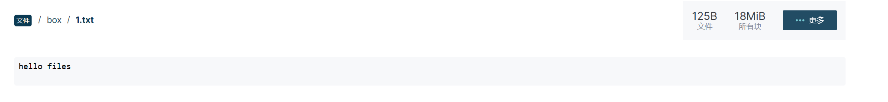
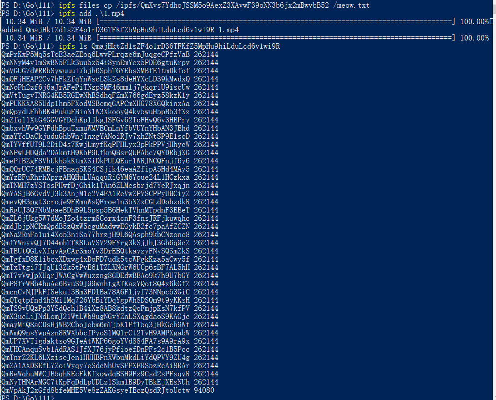

# 一 IPFS

## 1 基础cli操作

### 1 初始化

```
ipfs init
```

### 2 准备好启动 IPFS 守护程序以使节点联机

```
ipfs daemon
```

### 3 添加文件

```
ipfs add hello-ipfs.txt
```

这将会输出

```
added <cid> hello-ipfs.txt
6 B / 6 B [==========================================================] 100.00
```

### 4 检索文件

```
ipfs get <cid>
```

### 5 查看文件

```

```

### 6 固定数据

```
ipfs pin add <cid>
```

输出

```
pinned <cid>
```

### 7 取消固定文件

```
ipfs pin rm <cid>
```

输出

```
unpined <cid>
```

###  8 完全删除

```
ipfs repo gc
```

### 9 files 命令

#### 1 创建文件夹

```
ipfs files mkdir /box 
```


#### 2 create

```
ipfs files write --create /box/1.txt 
```



#### 3 快速

```
ipfs files cp  /ipfs/<cid>  /box/<dirname>
```


# 二 与IPFS网络交互

## 1 上线节点

```
ipfs daemon
```

## 2 查看对方IPFS地址

```
ipfs swarm peers
```

## 3 与 Web控制台节点交互

```
ipfs files cp /ipfs/<CID> /meow.txt
k51qzi5uqu5dij3dqujcphg4ggwwofrc8sev6xgvlnk4nzr29p5jhsvwudylc1
```

# 三 管理文件

## 1 使用block

添加文件大小大于256k ​	

```
ipfs add alargefile
ipfs ls thathash
```



## 2 块命令

```
ipfs catipfs block getipfs block get ipfs block statipfs refsipfs lsipfs object linksipfs refs
```

## 3 IPFS固定文件

​	固定是IPFS中一个非常重要的概念。IPFS 语义试图让每个对象都感觉是本地的——没有“从远程服务器为我检索此文件”，只有 或 ，无论实际对象位于何处，它们的行为方式都是一样的。`ipfs cat``ipfs get`

虽然这很好，但有时你希望能够控制你保留的东西。**固定**是一种机制，它允许你告诉IPFS始终将给定的对象保留在某个地方 - 默认是你的本地节点，但如果你使用[第三方远程固定服务](https://docs.ipfs.tech/how-to/work-with-pinning-services/)，这可能会有所不同。IPFS 有一个相当激进的缓存机制，在你对对象执行任何 IPFS 操作后，它会在短时间内将对象保留在本地，但这些对象可能会定期进行垃圾回收。要防止垃圾回收，只需固定您关心的 CID，或将其添加到 [MFS。](https://docs.ipfs.tech/concepts/file-systems/#mutable-file-system-mfs)默认情况下，通过添加的对象以递归方式固定。默认情况下，MFS 中的内容不会被固定，但会受到垃圾回收的保护，因此可以将 MFS 视为隐式固定的机制。`ipfs add`

### 1 远程固定服务


```
https://www.pinata.cloud/
```


